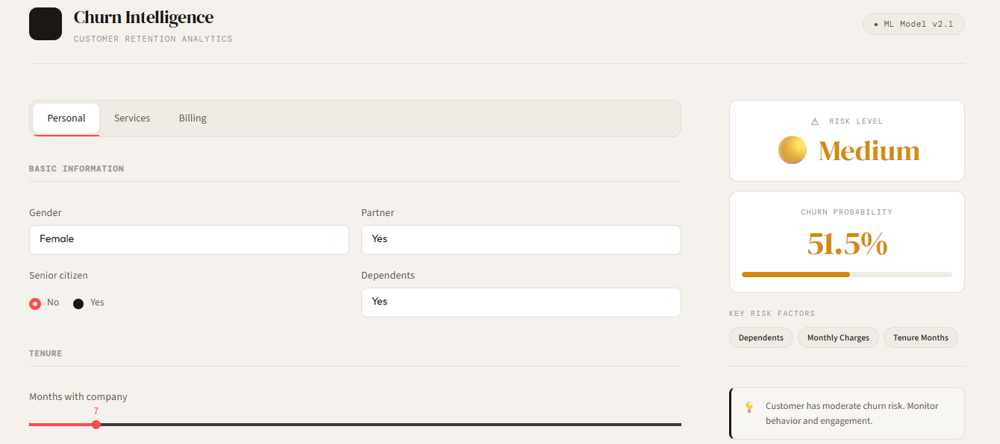

# Customer Churn Prediction

A complete end-to-end Machine Learning project for predicting customer churn using the IBM Telco Customer Churn dataset.

This project demonstrates the full lifecycle of a Machine Learning solution, including:
- Data preprocessing
- Exploratory Data Analysis (EDA)
- Feature engineering
- Model training
- Model explainability with SHAP
- FastAPI deployment
- Streamlit dashboard
- Docker containerization
- Automated testing with Pytest
- Continuous Integration with GitHub Actions
- Modular project architecture

## Live Demo

### Dashboard: https://tu-dashboard.onrender.com

### API Docs: https://churn-api-mlbh.onrender.com

## Project Overview

Customer churn prediction helps businesses identify customers who are likely to leave a service.

Using customer demographics, subscription information, account history, and service usage data, the model estimates the probability that a customer will churn and provides business recommendations for retention actions.

## Features

### Machine Learning Pipeline
- Data cleaning and preprocessing
- Missing value handling
- Feature encoding
- Feature selection
- Train/Test split
- SMOTE class balancing
- XGBoost classification
- Model evaluation
- Model persistence with Joblib

### Explainable AI (XAI)

The project includes SHAP (SHapley Additive Explanations) for model interpretability.

#### Features:
- Global feature importance
- Local prediction explanations
- Top churn risk factors per customer
- Business-friendly insights

### FastAPI Backend

REST API providing:

- Real-time predictions
- Churn probability estimation
- Risk classification
- Personalized recommendations
- SHAP-based feature explanations
- Interactive Swagger documentation

### Streamlit Dashboard

Modern customer-facing interface featuring:

- Customer profile forms
- Risk visualization
- Churn probability indicators
- Risk factor badges
- Recommendation panel
- Responsive UI
- Professional styling

### Dockerized Deployment

The application is fully containerized using Docker Compose.

Services:

- FastAPI Backend
- Streamlit Frontend

## Tech Stack

| Category | Technology |
|----------|------------|
| Language | Python |
| ML Framework | Scikit-Learn |
| Model | XGBoost |
| Explainability | SHAP |
| Data Processing | Pandas |
| Numerical Computing | NumPy |
| API | FastAPI |
| Dashboard | Streamlit |
| Containerization | Docker |
| Orchestration | Docker Compose |
| Serialization | Joblib |

## Project Structure

~~~
customer-churn-prediction/ 
│ 
├── .github/
│   └── workflows/
│       └── tests.yml
│ 
├── api/
│   ├── __init__.py 
│   ├── main.py 
│   ├── model_service.py
│   └── schemas.py
│ 
├── app/
│   ├── assets/ 
│   ├── streamlit_app.py 
│   └── styles.css 
│ 
├── data/ 
│   ├── raw/
│   │   └── telco_churn.xlsx
│   └── processed/ 
│ 
├── IMAGES/ 
│   └── Dashboard.png
│
├── notebooks/ 
│   ├── 01_eda_analysis.ipynb
│   └── 02_model_explainability.ipynb 
│
├── scripts/ 
│   └── train_model.py 
│ 
├── src/ 
│   ├── data/
│   └── models/ 
│
├── tests/
│   ├── test_api.py
│   └── test_model.py
│
├── .dockerignore
├── .gitignore
├── docker-compose.yml 
├── Dockerfile.api 
├── Dockerfile.streamlit 
├── pytest.ini
├── README.md
├── requirements-dev.txt 
├── requirements-prod.txt 
└── requirements.txt 
~~~

## Dataset

**Dataset used:** IBM Telco Customer Churn Dataset

**Target variable:** Churn Value

Values:

- 1 = Customer churns
- 0 = Customer remains

## Model Performance

Current production model: **XGBoost + SMOTE**

| Metric | Score |
|----------|--------|
| Accuracy | 73% |
| Recall | 73% |
| F1 Score | 59% |

Business objective: Maximize customer churn detection while maintaining acceptable precision.

The dataset is naturally imbalanced, making recall an important metric for identifying customers at risk.

## API Endpoints
**Health Check**
~~~
GET /

Response:
{
  "message": "Customer Churn Prediction API is running"
}
~~~

**Predict Churn**
~~~
POST /predict

Example Request:

{
  "gender": "Female",
  "senior_citizen": 0,
  "partner": "Yes",
  "dependents": "No",
  "tenure_months": 12,
  "phone_service": "Yes",
  "multiple_lines": "No",
  "internet_service": "Fiber optic",
  "online_security": "No",
  "online_backup": "No",
  "device_protection": "No",
  "tech_support": "No",
  "streaming_tv": "Yes",
  "streaming_movies": "Yes",
  "contract": "Month-to-month",
  "paperless_billing": "Yes",
  "payment_method": "Electronic check",
  "monthly_charges": 95.5,
  "total_charges": 1100.0
}

Example Response:

{
  "prediction": 1,
  "prediction_label": "Churn",
  "churn_probability": 0.91,
  "risk_level": "High",
  "recommendation": "Customer is at high risk of churn. Consider retention actions.",
  "top_factors": [
    "Contract",
    "Monthly Charges",
    "Internet Service"
  ]
}
~~~

## Running Locally

**Clone Repository**
~~~
git clone https://github.com/andresvm18/customer-churn-prediction.git 
cd customer-churn-prediction
~~~

**Create Virtual Environment**
~~~
python -m venv venv

Windows:
  venv\Scripts\activate

Linux / Mac:
  source venv/bin/activate
~~~

**Install Dependencies**
~~~
Development environment:
  pip install -r requirements-dev.txt

Production environment:
  pip install -r requirements-prod.txt
~~~

**Run FastAPI**
~~~
uvicorn api.main:app --reload

API available at: http://127.0.0.1:8000

Swagger UI: http://127.0.0.1:8000/docs
~~~

**Run Streamlit**
~~~
streamlit run app/streamlit_app.py

Dashboard: http://localhost:8501
~~~

**Docker Deployment**
~~~
Build and run both services: docker compose up --build

Run in background: docker compose up -d --build

Stop services: docker compose down
~~~

## Docker Architecture
~~~
┌─────────────────────┐
│     Streamlit       │
│     Dashboard       │
│     Port 8501       │
└──────────┬──────────┘
           │
           ▼
┌─────────────────────┐
│      FastAPI        │
│   Prediction API    │
│     Port 8000       │
└──────────┬──────────┘
           │
           ▼
┌─────────────────────┐
│  XGBoost + SHAP     │
│    Model Layer      │
└─────────────────────┘
~~~

## MLOps Architecture
~~~
Dataset
   │
   ▼
  EDA
   │
   ▼
Preprocessing
   │
   ▼
 SMOTE
   │
   ▼
XGBoost
   │
   ▼
Joblib Model
   │
   ├── FastAPI
   │
   └── Streamlit
~~~

## CI/CD Pipeline

The project uses GitHub Actions to:

- Install project dependencies
- Run automated tests
- Validate application integrity on every push and pull request

Workflow: **Developer → Push → GitHub Actions → Tests → Pass/Fail**

## Testing & CI/CD

The project includes automated testing and continuous integration.

### Automated Tests

- API endpoint tests
- Business logic tests
- Response validation tests

### Continuous Integration

GitHub Actions automatically:

- Installs dependencies
- Runs all unit tests
- Validates code before merge

Run tests locally:

~~~
pytest
~~~

## Future Improvements

Planned enhancements:

- MLflow experiment tracking
- Cloud deployment (Render / Railway)
- Monitoring and logging
- Authentication and authorization
- Model versioning
- Automated retraining pipeline
- Data drift detection

## Author

Andrés Víquez

LinkedIn: https://www.linkedin.com/in/andr%C3%A9s-v%C3%ADquez-marchena-b39490310/

GitHub: https://github.com/andresvm18