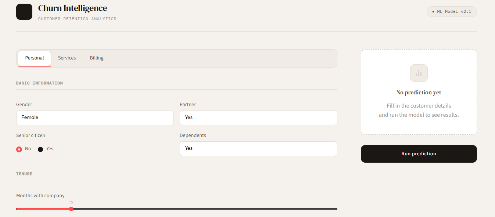
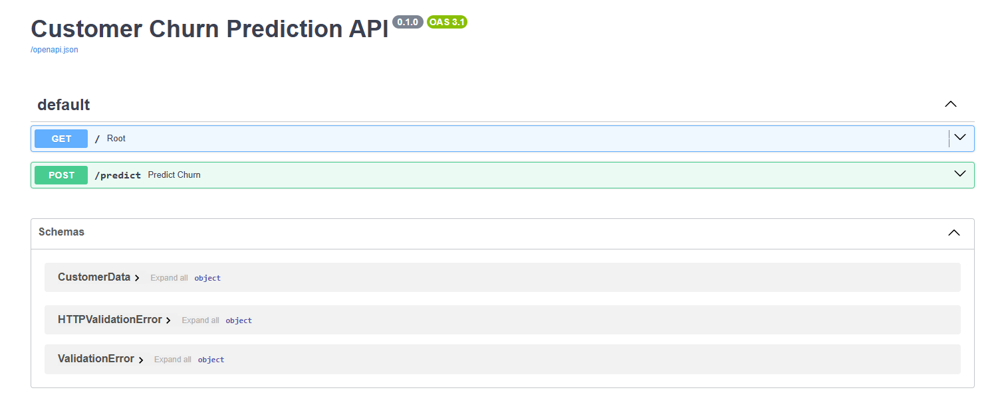

# Customer Churn Prediction

## Live Demo

### Dashboard: https://churn-dashboard-z386.onrender.com/

### API Docs: https://churn-api-mlbh.onrender.com/docs

A complete end-to-end Machine Learning project for predicting customer churn using the IBM Telco Customer Churn dataset.

This project demonstrates the full lifecycle of a Machine Learning solution, including:
- Data preprocessing
- Exploratory Data Analysis (EDA)
- Feature engineering
- Model training with optimized classification threshold
- Model explainability with SHAP
- Experiment tracking with MLflow
- FastAPI deployment
- Streamlit multi-page dashboard
- Batch prediction via CSV upload
- Docker containerization
- Automated testing with Pytest
- Continuous Integration with GitHub Actions
- Modular project architecture

## Project Overview

Customer churn prediction helps businesses identify customers who are likely to leave a service.

Using customer demographics, subscription information, account history, and service usage data, the model estimates the probability that a customer will churn and provides business recommendations for retention actions.

## Features

### Machine Learning Pipeline
- Data cleaning and preprocessing
- Missing value handling
- Feature encoding with LabelEncoder
- Feature selection (leakage-free)
- Train/Test split with stratification
- SMOTE class balancing
- XGBoost classification
- Optimized classification threshold via precision-recall analysis
- Model evaluation with full classification report
- Model persistence with Joblib
- Training metadata saved to JSON (date, metrics, hyperparameters, threshold analysis)

### Experiment Tracking with MLflow
- Every training run logged automatically with MLflow
- Parameters, metrics, and artifacts tracked per run
- Side-by-side comparison between configured threshold and default 0.5
- Local UI via `mlflow ui --backend-store-uri sqlite:///mlflow.db`
- SQLite backend for persistence across sessions

### Threshold Optimization
- `scripts/find_threshold.py` evaluates precision, recall, and F1 across all thresholds
- Generates precision-recall curve plot saved to `scripts/threshold_analysis/`
- Threshold configurable in `api/config.py` — no code changes needed elsewhere
- Current threshold: **0.37** (up from default 0.5), improving churn recall from 68% to **77%**

### Explainable AI (XAI)
- Global feature importance via SHAP TreeExplainer
- Local prediction explanations per customer
- Top 3 churn risk factors returned as `"Column: value"` strings
- Business-friendly labels rendered as badges in the dashboard

### FastAPI Backend
REST API providing:
- Strict input validation via Pydantic `Literal` types and `Field` constraints
- Single customer prediction (`POST /predict`)
- Batch prediction from CSV (`POST /predict/batch` and `POST /predict/batch/download`)
- Churn probability estimation
- Risk classification (Low / Medium / High)
- Personalized recommendations
- SHAP-based feature explanations
- Structured error responses (422 / 503 / 500)
- Interactive Swagger documentation

### Streamlit Dashboard
Multi-page interface with sidebar navigation:

**Single Prediction page:**
- Customer profile form organized in tabs (Personal, Services, Billing)
- Circular gauge for churn probability
- Risk factor badges with human-readable labels
- Recommendation panel
- Customer snapshot card
- Real-time prediction via FastAPI

**Batch Prediction page:**
- CSV template download with sample data
- File uploader with preview (first 5 rows)
- Summary metrics: total customers, predicted churn rate, errors
- Risk breakdown by level (High / Medium / Low)
- Full results table with downloadable CSV output
- Limit: 1 000 rows per batch

### Dockerized Deployment
- FastAPI backend with `/health` healthcheck endpoint
- Streamlit frontend waits for API to be healthy (`condition: service_healthy`)
- Automatic restart policy (`unless-stopped`)

## Tech Stack

| Category | Technology |
|----------|------------|
| Language | Python 3.11 |
| ML Framework | Scikit-Learn |
| Model | XGBoost |
| Class Balancing | imbalanced-learn (SMOTE) |
| Explainability | SHAP |
| Experiment Tracking | MLflow |
| Data Processing | Pandas / NumPy |
| API | FastAPI |
| Dashboard | Streamlit (multi-page) |
| Containerization | Docker |
| Orchestration | Docker Compose |
| Serialization | Joblib |
| Testing | Pytest + pytest-cov |
| CI/CD | GitHub Actions |

## Project Structure

~~~
customer-churn-prediction/
│
├── .github/
│   └── workflows/
│       └── tests.yml
│
├── api/
│   ├── __init__.py
│   ├── config.py          # Single source of truth: paths, columns, thresholds
│   ├── main.py            # FastAPI app, single and batch endpoints
│   ├── model_service.py   # Prediction pipeline and SHAP logic
│   └── schemas.py         # Pydantic schemas (single + batch)
│
├── app/
│   ├── streamlit_app.py   # Navigation entry point
│   ├── pages/
│   │   ├── single.py      # Single prediction dashboard
│   │   └── batch.py       # Batch prediction page
│   └── styles.css
│
├── data/
│   ├── raw/
│   │   └── telco_churn.xlsx
│   └── processed/
│
├── images/
│   ├── dashboard-home.png
│   ├── dashboard-prediction.png
│   └── swagger-api.png
│
├── notebooks/
│   ├── 01_eda_analysis.ipynb
│   └── 02_model_explainability.ipynb
│
├── scripts/
│   ├── train_model.py         # Training pipeline with MLflow tracking
│   └── find_threshold.py      # Precision-recall threshold analysis
│
├── src/
│   └── models/
│       ├── churn_model.pkl
│       ├── label_encoders.pkl
│       └── metadata.json      # Training date, metrics, threshold analysis
│
├── tests/
│   ├── test_api.py            # Endpoint tests: happy path, 422, 503, 500
│   ├── test_model.py          # Business logic: risk level, recommendations
│   └── test_preprocessing.py  # Encoding, unseen categories, SHAP format
│
├── .dockerignore
├── .env                       # LOKY_MAX_CPU_COUNT (not committed)
├── .flake8
├── .gitignore
├── docker-compose.yml
├── Dockerfile.api
├── Dockerfile.streamlit
├── mlflow.db                  # MLflow SQLite backend (not committed)
├── pytest.ini
├── README.md
├── requirements-dev.txt
├── requirements-prod.txt
└── requirements.txt
~~~

## Dataset

**Dataset:** IBM Telco Customer Churn Dataset

**Target variable:** `Churn Value`

- `1` = Customer churns
- `0` = Customer remains

## Model Performance

Current production model: **XGBoost + SMOTE + optimized threshold (0.37)**

| Metric | Default threshold (0.50) | Optimized threshold (0.37) |
|--------|--------------------------|---------------------------|
| Accuracy | 78.5% | 77.1% |
| Precision (churn) | 0.58 | 0.55 |
| Recall (churn) | 0.68 | **0.77** |
| F1 (churn) | 0.63 | 0.64 |

Business objective: maximize churn detection (recall on class 1). Lowering the threshold from 0.50 to 0.37 catches 9 more churners per 100 at the cost of a small precision drop — the right trade-off for a retention team.

Run `python scripts/find_threshold.py` to re-evaluate thresholds on the current model and update `CLASSIFICATION_THRESHOLD` in `api/config.py`.

## API Endpoints

**Health Check**
~~~
GET /health

Response:
{
  "status": "healthy"
}
~~~

**Single Prediction**
~~~
POST /predict

Example Request:
{
  "gender": "Female",
  "senior_citizen": 0,
  "partner": "Yes",
  "dependents": "No",
  "tenure_months": 12,
  "phone_service": "Yes",
  "multiple_lines": "No",
  "internet_service": "Fiber optic",
  "online_security": "No",
  "online_backup": "No",
  "device_protection": "No",
  "tech_support": "No",
  "streaming_tv": "Yes",
  "streaming_movies": "Yes",
  "contract": "Month-to-month",
  "paperless_billing": "Yes",
  "payment_method": "Electronic check",
  "monthly_charges": 95.5,
  "total_charges": 1146.0
}

Example Response:
{
  "prediction": 1,
  "prediction_label": "Churn",
  "churn_probability": 0.9137,
  "risk_level": "High",
  "recommendation": "Customer is at high risk of churn. Consider retention actions.",
  "top_factors": [
    "Contract: Month-to-month",
    "Monthly Charges: 95.5",
    "Tenure Months: 12"
  ]
}
~~~

**Batch Prediction (JSON)**
~~~
POST /predict/batch
Content-Type: multipart/form-data
Body: file=<your_customers.csv>

Response:
{
  "total_rows": 5,
  "successful": 5,
  "failed": 0,
  "results": [
    {
      "row_index": 0,
      "status": "ok",
      "prediction": 1,
      "prediction_label": "Churn",
      "churn_probability": 0.9185,
      "risk_level": "High",
      "recommendation": "Customer is at high risk of churn...",
      "top_factors": ["Monthly Charges: 95.5", "Contract: Month-to-month"]
    }
  ]
}
~~~

**Batch Prediction (CSV download)**
~~~
POST /predict/batch/download
Content-Type: multipart/form-data
Body: file=<your_customers.csv>

Returns: churn_predictions.csv with all original columns + prediction results
~~~

Limit: 1 000 rows per request.
Validation errors return HTTP `422`. Service unavailable returns HTTP `503`.

## Running Locally

**Clone Repository**
~~~
git clone https://github.com/andresvm18/customer-churn-prediction.git
cd customer-churn-prediction
~~~

**Create Virtual Environment**
~~~
python -m venv venv

# Windows:
venv\Scripts\activate

# Linux / Mac:
source venv/bin/activate
~~~

**Install Dependencies**
~~~
# Development (includes training, testing, MLflow, and linting tools):
pip install -r requirements-dev.txt

# Production only:
pip install -r requirements-prod.txt
~~~

**Train the Model**
~~~
python scripts/train_model.py
~~~

Generates:
- `src/models/churn_model.pkl`
- `src/models/label_encoders.pkl`
- `src/models/metadata.json`
- MLflow run logged to `mlflow.db`

**Analyze Threshold (optional)**
~~~
python scripts/find_threshold.py
~~~

Generates:
- `scripts/threshold_analysis/threshold_results.json`
- `scripts/threshold_analysis/threshold_analysis.png`
- Updates `src/models/metadata.json` with threshold recommendations

**View MLflow UI**
~~~
mlflow ui --backend-store-uri sqlite:///mlflow.db
~~~

Open: http://localhost:5000

**Run FastAPI**
~~~
uvicorn api.main:app --reload

API available at:  http://127.0.0.1:8000
Swagger UI:        http://127.0.0.1:8000/docs
~~~

**Run Streamlit**
~~~
streamlit run app/streamlit_app.py

Dashboard: http://localhost:8501
~~~

**Docker Deployment**
~~~
# Build and start both services:
docker compose up --build

# Run in background:
docker compose up -d --build

# Stop services:
docker compose down
~~~

The dashboard container waits for the API healthcheck to pass before starting.

## Docker Architecture

~~~
┌─────────────────────┐
│     Streamlit       │
│     Dashboard       │
│     Port 8501       │
└──────────┬──────────┘
           │ (waits for healthy)
           ▼
┌─────────────────────┐
│      FastAPI        │
│   Prediction API    │
│     Port 8000       │
│   GET /health ✓     │
└──────────┬──────────┘
           │
           ▼
┌─────────────────────┐
│  XGBoost + SHAP     │
│    Model Layer      │
└─────────────────────┘
~~~

## MLOps Architecture

~~~
Dataset
   │
   ▼
  EDA (notebooks/)
   │
   ▼
Preprocessing + Encoding
   │
   ▼
 SMOTE
   │
   ▼
Threshold Analysis
(find_threshold.py)
   │
   ▼
XGBoost Training
(train_model.py)
   │
   ▼
MLflow Run Logged
   │
   ▼
Joblib Artifacts + metadata.json
   │
   ├── FastAPI (api/)
   │     ├── POST /predict
   │     └── POST /predict/batch
   │
   └── Streamlit (app/)
         ├── Single Prediction
         └── Batch Prediction
~~~

## CI/CD Pipeline

GitHub Actions runs on every push and pull request to `main`:

1. Install dependencies (`requirements-dev.txt`)
2. Run all tests with coverage (`pytest --cov=api`)
3. Check code style (`flake8`)
4. Validate formatting (`black --check`)

**Workflow:** Developer → Push → GitHub Actions → Tests + Lint → Pass / Fail

## Testing

The project includes 45 automated tests across 3 files with 78% coverage on the API layer.

| File | What it covers |
|------|---------------|
| `test_api.py` | Endpoints: happy path, 7 validation cases (422), service errors (503 / 500) |
| `test_model.py` | Risk level thresholds, recommendations, DataFrame building |
| `test_preprocessing.py` | Encoding pipeline, unseen categories, SHAP factor format |

Run locally:

~~~
# All tests with coverage:
pytest --cov=api --cov-report=term-missing -v

# Quick run:
pytest
~~~

## Future Improvements

- Automated retraining pipeline triggered by data drift detection (Evidently AI)
- A/B testing for model versions via MLflow model registry
- Authentication and authorization (API key / JWT)
- Cloud deployment monitoring and alerting
- Structured JSON logging for production observability

## Author

Andrés Víquez

LinkedIn: https://www.linkedin.com/in/andr%C3%A9s-v%C3%ADquez-marchena-b39490310/

GitHub: https://github.com/andresvm18